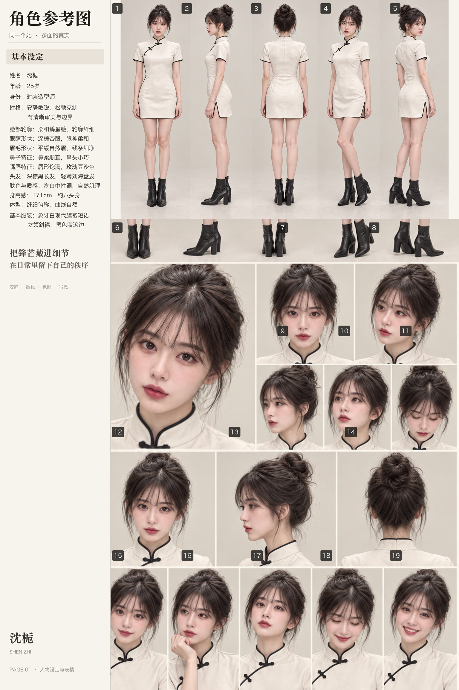
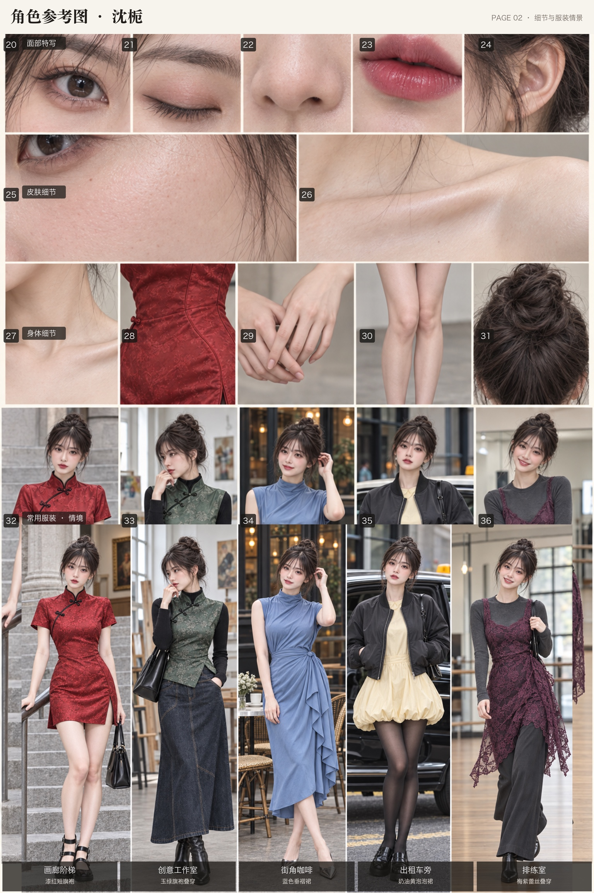
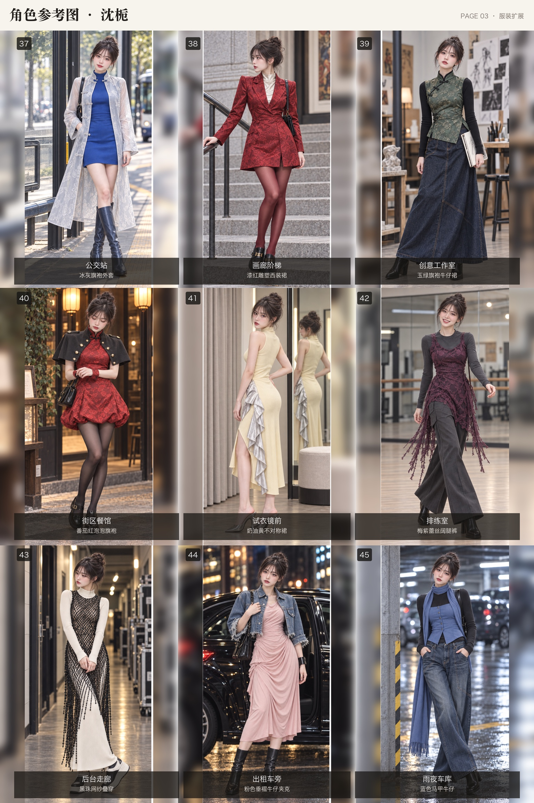

# Character Card Generator

把一张或多张成年人物主图扩展成高清、多页、可复用的角色参考卡。

## 效果示例：沈栀

同一人物贯穿设定、细节与服装扩展三页。点击图片可查看高清预览。

### 第 1 页 · 人物设定与表情

<p align="center">
  <a href="examples/shen-zhi/page1-profile.jpg"></a>
</p>

### 第 2 页 · 细节与场景

<p align="center">
  <a href="examples/shen-zhi/page2-details-scenes.jpg"></a>
</p>

### 第 3 页 · 服装扩展

<p align="center">
  <a href="examples/shen-zhi/page3-wardrobe.jpg"></a>
</p>

第 1、2 页示例原图为 3072×4608 PNG，第 3 页为 3072×6144 PNG；仓库内预览分别为 1536×2304 与 1536×3072。

## 核心能力

- 一张主图对应一个身份，同一卡内锁定脸、发型、年龄感和身材比例。
- 服装场景保持同一人物，同时改变表情、视线、脸部角度、手部动作和姿态。
- 默认服装页采用完整的年轻时装编辑系统：九套按三套旗袍或旗袍衍生、三套连衣裙、三套叠穿造型组织；同时强制加入宽松下装、外套造型、动态细节、运动与精致材质碰撞以及真实街头场景，限制长窄裙和传统高跟鞋的重复。
- 不同角色卡重新建立身份锚点，避免跨卡串脸。
- 图片主体无字生成，中文标题和必要标签由本地 ImageMagick 模板排版；默认不添加数字角标。
- 第二、三页采用硬分格排版，每个服装格只出现一个人物实例；禁止镜像、倒影、模糊人物补边、重复裁切和跨格叠图。
- 第一页保留人物设定文字；第二、三页只输出铺满画布的纯图片拼接，不添加页眉、页码、标题、标签或说明。
- 第三页默认使用紧密的 3×3、1:2 纵向网格；高清档采用 12px 横向与 24px 纵向浅色分隔线，不保留大块空白边栏，不拉伸单图。
- 默认输出完整三页高清卡：第一、二页为 3072×4608 PNG，第三页为 3072×6144 PNG。

## 安装

将仓库复制到 Codex Skills 目录：

```bash
git clone https://github.com/jason841107/character-card-generator-skill.git \
  ~/.codex/skills/character-card-generator
```

公开仓库无需额外的 GitHub 访问权限。

## 使用

在 Codex 中附上人物主图，并输入：

```text
使用 $character-card-generator 根据这张主图生成完整三页高清角色卡。
```

还可以指定风格包、页数和清晰度，例如：

```text
使用 $character-card-generator 生成新中式旗袍和都市连衣裙为主的服装扩展页，高清档。
```

## 清晰度

- `standard`：第一、二页 2048×3072；第三页 2048×4096。
- `hd`：第一、二页 3072×4608；第三页 3072×6144，默认。
- `ultra`：第一、二页 4096×6144；第三页 4096×8192。

## 目录

```text
SKILL.md
agents/openai.yaml
references/
assets/layouts/
```

人物姓名、年龄、职业、性格和生活经历均作为虚构创作设定。性感或修身造型只用于明确的成年人，并保持完整穿着。

## 许可证

本项目采用 [MIT License](LICENSE)。
